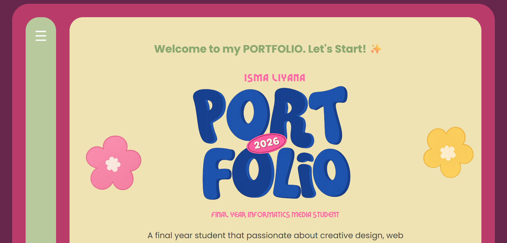
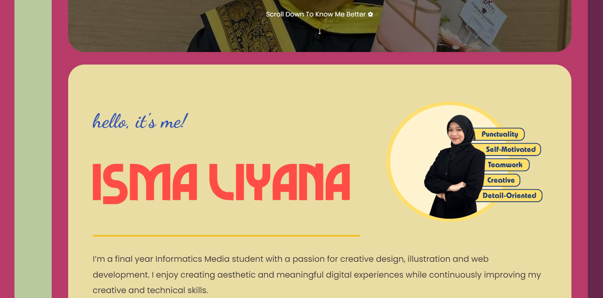
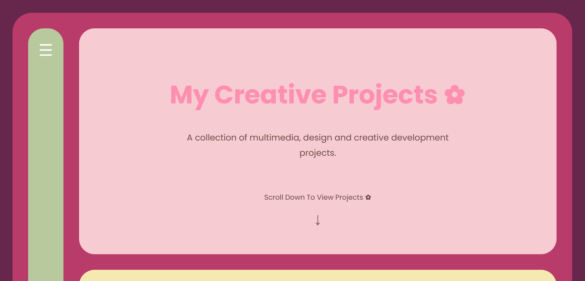
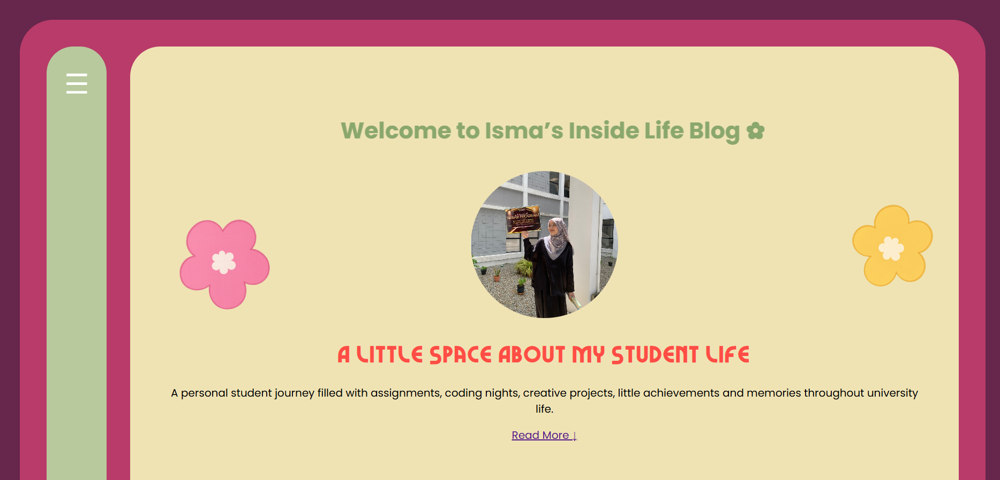
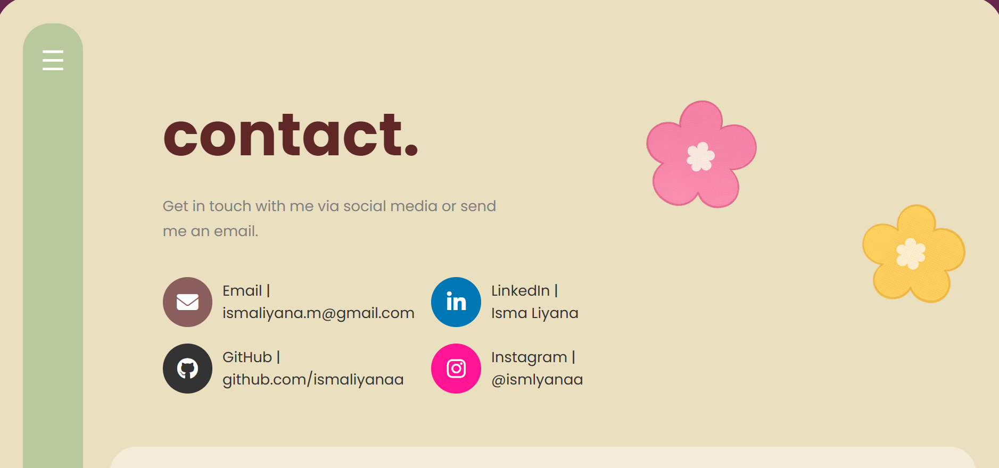

# 🌸 Portfolio 2026


## 👋 Hey!

I'm **Isma Liyana**.

🎓 Final Year Informatics Media Student

🏫 Universiti Sultan Zainal Abidin (UniSZA), Besut Campus

💻 Passionate about Web Design, UI/UX Design and Digital Media

✨ Welcome to my personal portfolio website where I showcase my projects, achievements and university journey.

---

## 📖 Project Overview

Portfolio 2026 is a personal portfolio website developed using HTML, CSS and JavaScript.

The website serves as a digital platform to introduce myself, showcase my academic projects, share my achievements and document my experiences as an Informatics Media student.

One of the key sections of this website is the Journey Blog Page, where I share my university life, including assignments, coding challenges, project development, achievements and memorable experiences throughout my studies. The blog reflects the reality of student life and highlights how I continue to learn, adapt and grow through every challenge.

This portfolio represents both my technical skills and personal growth during my academic journey.

---

## ✨ Features

### 🏠 Home Page
- Portfolio landing page
- Personal introduction
- Quick navigation to other sections

### 👩 About Me Page
- Educational background
- Technical skills
- Software proficiency

### 💼 Projects Page
- Showcase of completed projects
- Project descriptions
- Tools and software used in each project

### 📝 Journey Blog Page
- Personal student journey
- University experiences
- Assignments and project reflections
- Coding challenges and achievements
- Memorable moments throughout university life

### 📩 Contact Page
- Email information
- LinkedIn profile
- GitHub profile
- Instagram account

### 📱 Responsive Design
- User-friendly interface
- Consistent design across different pages
- Easy navigation experience

---

## 🛠 Technologies Used

- HTML5
- CSS3
- JavaScript

---

## 📸 Screenshots

### Home Page



### About Me Page



### Projects Page



### Journey Blog Page



### Contact Page



---

## 🚀 Live Demo

Portfolio Website:

https://ismaliyanaa.github.io/ismaliyana-webfolio/

---

## 📂 GitHub Repository

Repository Link:

https://github.com/ismaliyanaa/ismaliyana-webfolio

---

## 📁 Folder Structure

```text
ISMALIYANA-WEBFOLIO
│
├── assets/
├── fonts/
├── index.html
├── about.html
├── projects.html
├── journeyblog.html
├── contact.html
├── style.css
├── projects.css
├── journey.css
├── contact.css
└── README.md
```

## ▶️ How to Run the Project

1. Download or clone the repository.
2. Open the project folder.
3. Open `index.html` in your preferred web browser.
4. Navigate through the pages using the menu provided.
5. Explore the Home, About Me, Projects, Journey Blog and Contact sections.

---

## 👩 Author

**Isma Liyana**

Final Year Informatics Media Student

Universiti Sultan Zainal Abidin (UniSZA)

GitHub: https://github.com/ismaliyanaa

Portfolio Website:
https://ismaliyanaa.github.io/ismaliyana-webfolio/

---

⭐ Thank you for visiting my portfolio website!
